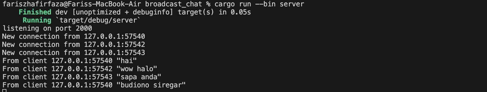
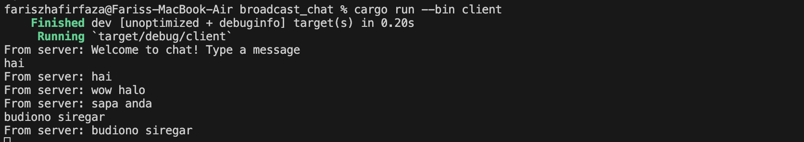
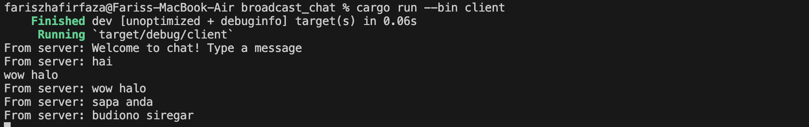

Tutorial Broadcast chat

- 2.1 Original code, and how it run

    
    
    
    

    Once the server is initiated using `cargo run --bin server` and each client is launched with `cargo run --bin client`, the displayed output illustrates that both the server and every client receive broadcasted chats from each connected client. Whenever a client inputs a message via the command line, the string is transmitted to the server, which then disseminates it to all connected clients.

- 2.2 Modifying port

    To modify the port to 8080, we need to change it in both the client and server sides. In the client code we need to change the URI to use port 8080 instead of 2000. This change will make the client connect to port 8080 on the localhost. For the server-side modification, we need to ensure that the server is also listening on port 8080. This involves modifying the server code where the WebSocket server is initialized. In the server code, we should look for the part where the WebSocket server is created and make sure it listens on port 8080. This typically involves configuring the server to bind to the appropriate address and port. Once both the client and server are configured to use port 8080, ensure that any firewall or network configurations allow traffic on that port. If the client's port configuration remains unchanged while the server's port is modified, it will result in a connection failure between the client and the server. The client will attempt to establish a WebSocket connection to the server on port 2000, as per its configuration. However, since the server is now listening on port 8080, the connection request from the client won't reach the server. Instead, it will encounter a connection error or timeout. Therefore, it's crucial for both the client and server to use the same port for successful communication, ensuring that the client can reach the server at the specified address and port.