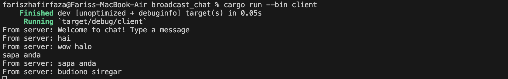

Tutorial Broadcast chat

- 2.1 Original code, and how it run

    
    
    
    

    Once the server is initiated using `cargo run --bin server` and each client is launched with `cargo run --bin client`, the displayed output illustrates that both the server and every client receive broadcasted chats from each connected client. Whenever a client inputs a message via the command line, the string is transmitted to the server, which then disseminates it to all connected clients.